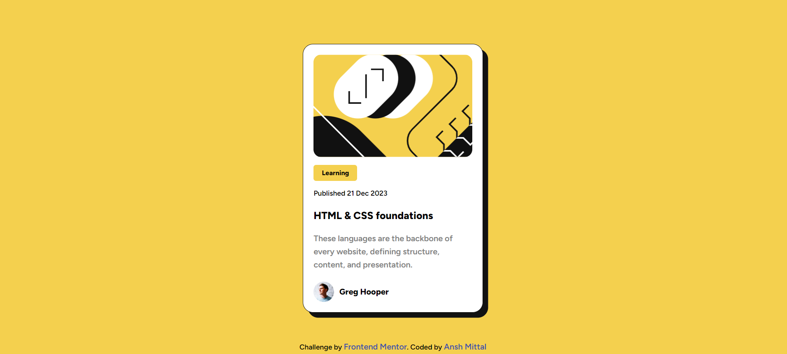
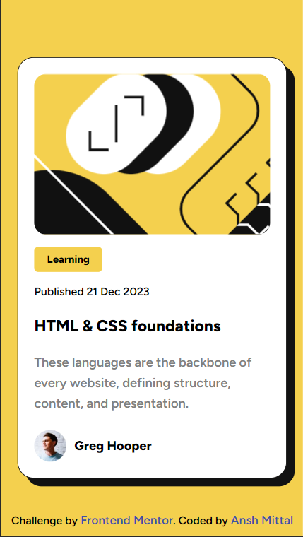

# Blog preview card solution

This is a solution to the [Blog preview card challenge on Frontend Mentor](https://www.frontendmentor.io/challenges/blog-preview-card-ckPaj01IcS). 

## Table of contents

- [Overview](#overview)
  - [Screenshot](#screenshot)
  - [Links](#links)
  - [Built with](#built-with)
  - [What I learned](#what-i-learned)
  - [Continued development](#continued-development)
- [Author](#author)

## Overview

This project is a responsive blog preview card created as a challenge from Frontend Mentor. It showcases the use of HTML and CSS to build a clean and visually appealing card, highlighting essential information about a blog post.

### Screenshot Desktop

### Screenshot mobile

### Links

- Solution URL: [Add solution URL here](https://your-solution-url.com)
- Live Site URL: [Add live site URL here](https://your-live-site-url.com)

### Built with

- HTML5
- CSS3
- Semantic HTML5 markup
- CSS custom properties
- Flexbox
- Mobile-first workflow

### What I learned

I learned lots of more from project.
- How to make responsive font-sizes in one line css code
- How to make code more readable for others
- How to make code more clean
- How to make project maintainable using comments
And also...
- How to use css variable for telling which colors and typography is used to make this project

### Continued development

"I am committed to actively developing challenges on the Frontend Mentor website to enhance my skills and knowledge as a frontend web developer. My goal is to complete a set number of challenges at least 4 in a month. I am passionate about frontend development and excited about the opportunity to grow and excel in this dynamic field."

## Author

- Frontend Mentor - [@Anshmittal86](https://www.frontendmentor.io/profile/Anshmittal86)
- LinkedIn - [@Anshmittal86](https://www.linkedin.com/in/anshmittal86)

